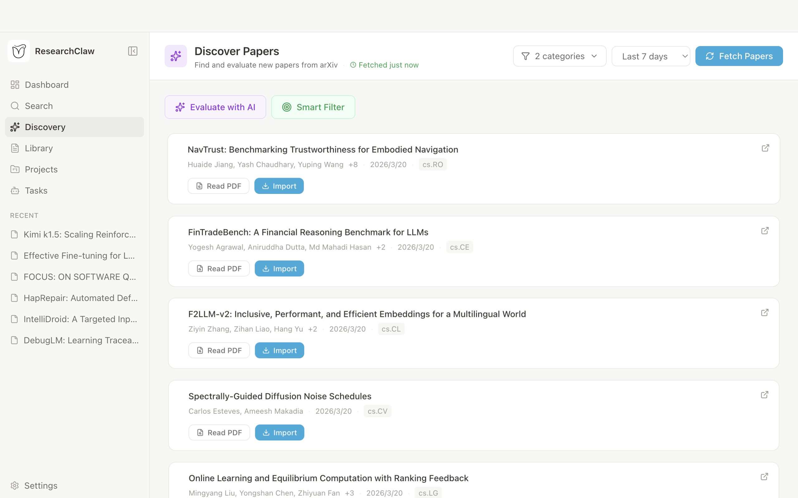

<p align="center">
  
</p>

<h1 align="center">ResearchClaw</h1>

<p align="center">
  <strong>AI 驱动的科研桌面应用</strong>
</p>

<p align="center">
  文献管理、智能阅读笔记和研究创意生成 — 一站式原生应用
</p>

<p align="center">
  <a href="https://github.com/Noietch/ResearchClaw/stargazers"></a>
  <a href="LICENSE"></a>
  <a href="https://github.com/Noietch/ResearchClaw/pulls"></a>
</p>

---

## 什么是 ResearchClaw？

**ResearchClaw** 是一个独立的 **Electron 桌面应用**，专为科研工作者设计。它将 AI 驱动的论文管理、交互式阅读和创意生成整合在一个简洁的界面中 — 无需浏览器、无需服务器、无需插件。

## 界面截图

### 主界面


_今日 arXiv 论文，附带 AI 自动生成的分类标签（transformer、nlp、planning、instruction-following 等）_

### 阅读笔记


_AI 驱动的阅读界面，支持结构化笔记卡片_

### 论文发现



_从 arXiv 发现新论文，AI 质量评估和基于文献库的相关度智能筛选_

### 项目与创意


_将论文组织成项目，并生成 AI 驱动的研究创意_

## 核心功能

### 论文发现与导入

| 功能                 | 描述                                                                                          |
| :------------------- | :-------------------------------------------------------------------------------------------- |
| **论文发现**         | 按分类（cs.AI、cs.LG、cs.CL、cs.CV 等）浏览最新 arXiv 论文，支持时间范围筛选                 |
| **AI 质量评估**      | 从新颖性、方法论、重要性和清晰度四个维度评估论文，0-10 分制打分                               |
| **智能筛选**         | 根据你现有文献库计算相关度（0-100%），帮你快速定位最相关的论文                                 |
| **AlphaXiv 摘要**    | 自动从 AlphaXiv 获取 AI 生成的论文摘要，快速了解论文要点                                      |
| **论文导入**         | 从 Chrome 历史批量导入、arXiv ID/URL、本地 PDF、Zotero、BibTeX/RIS 或 Overleaf 导入           |
| **阅读列表**         | 临时保存论文（24小时），来自发现页或引用文献，快速阅读但不占用文献库                           |

### 阅读与笔记

| 功能               | 描述                                                             |
| :----------------- | :--------------------------------------------------------------- |
| **PDF 阅读器**     | 内置 PDF 阅读器，支持页面导航、缩放和宽度自适应                   |
| **AI 对话**        | 并排聊天面板，由 Claude 驱动 — 可询问贡献、方法、局限等问题       |
| **阅读卡片**       | AI 自动填充结构化阅读笔记卡片；支持 Vibe（AI）/ 手动编辑模式切换  |
| **自动笔记**       | 一键生成 AI 阅读总结并保存为笔记                                  |
| **引用提取**       | 自动检测并提取 PDF 中的参考文献；可在文献库或在线搜索              |

### 文献库与组织

| 功能               | 描述                                                             |
| :----------------- | :--------------------------------------------------------------- |
| **文献库**         | 按分类、标签、时间范围和年份筛选；支持标题、摘要和语义搜索         |
| **多层标签系统**   | 按 Domain / Method / Topic 自动标注论文；支持批量管理、合并和整理 |
| **论文对比**       | 选择 2-3 篇论文，生成 AI 驱动的对比分析                          |
| **BibTeX 导出**    | 将选中论文导出为 BibTeX 格式，方便 LaTeX 集成                    |
| **语义搜索**       | 基于 Embedding 的相似度搜索，跨文献库全面检索                    |
| **智能搜索**       | AI 使用多步工具调用自主搜索你的文献库（Beta）                     |
| **引用图谱**       | 交互式引用网络可视化，支持多种布局算法和 PNG 导出                 |

### 项目与任务

| 功能               | 描述                                                             |
| :----------------- | :--------------------------------------------------------------- |
| **项目管理**       | 将论文、代码仓库和待办事项组织成研究项目                          |
| **AI 创意生成**    | 基于项目中的论文集合生成研究创意                                  |
| **Agent 任务**     | 运行 AI Agent 任务，支持状态追踪（运行中 / 已完成 / 失败 / 空闲）|

### 配置与基础设施

| 功能               | 描述                                                             |
| :----------------- | :--------------------------------------------------------------- |
| **多 AI 提供商**   | 配置 Anthropic、OpenAI、Gemini 或任意 OpenAI 兼容 API             |
| **CLI 工具**       | 直接在应用内运行 Claude Code、Codex 或 Gemini CLI                 |
| **代理支持**       | HTTP/SOCKS 代理用于下载、API 调用和 Agent — 附带连通性测试        |
| **Token 用量统计** | 通过动态折线图和 GitHub 风格热力图追踪 API 使用情况               |
| **国际化**         | 完整中英双语界面，支持系统语言自动检测                            |

## 环境要求

- macOS 12+（arm64 / x64）、Windows 10+（x64 / arm64）或 Linux（x64 / arm64）
- Node.js >= 18（从源码构建时需要）

## 快速开始

```bash
# 克隆并安装
git clone https://github.com/Noietch/ResearchClaw.git
cd ResearchClaw
npm install

# 开发模式
npm run dev

# 构建并打包
npm run release:mac    # macOS → .dmg（arm64 + x64）
npm run release:win    # Windows → NSIS 安装包（x64 + arm64）
npm run release:linux  # Linux → AppImage（x64 + arm64）
```

## 项目架构

```
src/
  main/       # Electron 主进程（IPC 处理器、服务、存储）
  renderer/   # Vite + React UI
  shared/     # 共享类型、工具函数、提示词
  db/         # Prisma + SQLite 数据层
prisma/       # schema.prisma
tests/        # 集成测试（服务层）
scripts/      # build-main.mjs, build-release.sh
```

- **数据库**：SQLite via Prisma，路径 `~/.researchclaw/researchclaw.db`
- **AI**：Vercel AI SDK，支持 Anthropic、OpenAI、Gemini 及 OpenAI 兼容提供商
- **构建**：esbuild（主进程）+ Vite（渲染进程）

## 许可证

[CC BY-NC 4.0](LICENSE) — 免费用于非商业用途，需注明来源，禁止商业使用。

## Star History

<a href="https://star-history.com/#Noietch/VibeResearch&Date">
 <picture>
   <source media="(prefers-color-scheme: dark)" srcset="https://api.star-history.com/svg?repos=Noietch/VibeResearch&type=Date&theme=dark" />
   <source media="(prefers-color-scheme: light)" srcset="https://api.star-history.com/svg?repos=Noietch/VibeResearch&type=Date" />
   
 </picture>
</a>

---

<p align="center">
  Built with ❤️ for the research community.
</p>
